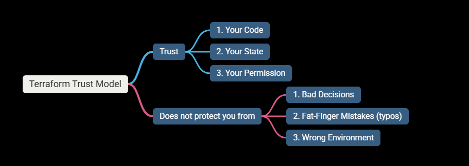

# 🧠 Lesson 1: Why Terraform Is Dangerous Without a Platform Mindset

## 1️⃣ Terraform Is NOT a Tool — It’s a Contract

### Terraform:

- Declares desired state.
- Enforces it without context.
- Does NOT understand business impact.

### If we say destroy in terraform, then it doesn't care if that's:

- Production
- Revenue-generating
- Customer-facing

# As a Devops Engineer ⚠️ You must care.

### 🚫 What juniors think : “CI/CD is about automation”

### ✅ What seniors know : “CI/CD is about CONTROL”

### Big companies design pipelines to:

- Block unsafe changes
- Force reviews
- Slow people down (intentionally)
- Protect prod at all costs
- Speed is secondary.

---

# When Do We Create Projects in GCP?

### Terraform should not create everything blindly.

### In real companies:

- Some projects are bootstrapped once.
- Some are fully Terraform-managed.
- Some are off-limits (security/billing).

---

# Why Terraform Causes Outages?

## Real reasons:

- Same state used by multiple envs
- Manual console changes
- Poor IAM
- No approvals
- No blast radius control

### Terraform does exactly what you tell it.

# 3️⃣ As A Platform Engineer Responsibility:

- You must Designs guardrails.
- Applies via pipeline.
- Prevents break.
- Thinks in systems.

---

# 4️⃣ The Terraform Trust Model

## 👉 That’s your job as a Platform Engineer.

---

# Q & A

## 1️⃣ Why is running terraform apply from a laptop dangerous?

Running terraform apply from a laptop is dangerous because:

- There is no approval gate
- No audit trail
- Credentials are often over-privileged
- Human error is unbounded (wrong branch, wrong env)
- Laptops bypass organizational controls

### Note: The danger is not Terraform — it’s uncontrolled execution.

### “Terraform should only execute from controlled pipelines with enforced permissions and approvals.”

## 2️⃣ What could go wrong if dev and prod share the same state?

If dev and prod share the same state:

- Resources overwrite each other.
- Dev applies can destroy prod.
- No isolation of blast radius.
- Rollbacks become impossible.
- State corruption affects all environments.

## “State defines ownership. Sharing state means sharing destruction rights.”

## 3️⃣ Why do enterprises slow down CI/CD on purpose?

Enterprises slow down CI/CD to:

- Reduce blast radius.
- Enforce human review.
- Prevent accidental prod changes.
- Ensure compliance & audits.
- Protect revenue and customers.

### Note: Speed is for features. Infrastructure prioritizes safety.

## “Infrastructure pipelines are designed for control, not speed.”
