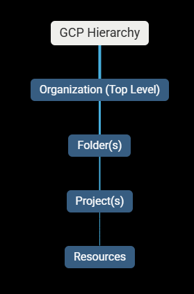
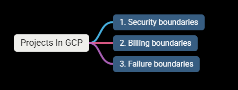

# 🧠 Lesson 2: How GCP Is Structured (This Changes Everything)

### Terraform makes sense only after you understand GCP hierarchy.

## 1️⃣ GCP Is NOT Just Projects

Understand first GCP Hierarchy:

Organization
└── Folder(s)
└── Project(s)
└── Resources

## Each level has:

- IAM
- Policies
- Billing implications

### Platform Engineers think TOP → DOWN

---

## 2️⃣ Why Projects Are Disposable (Critical Insight)

Projects in GCP are:

### Enterprises treat projects as:

#### “Replaceable containers, not long-lived pets”

# 💥 This is why:

- Environments = separate projects.
- Teams = separate projects.
- Experiments = separate projects.

---

## 3️⃣ IAM Inheritance (Most People Get This Wrong)

IAM flows downward:

- Org → Folder → Project → Resource

### Meaning:

- A bad permission at Org level = catastrophe.
- Least privilege starts at the top.

## “Never grant at Org unless unavoidable.”

---

## 4️⃣ Where Terraform Fits in GCP?

Terraform usually:

-❌ Does NOT manage Organization

-⚠️ Sometimes manages Folders

- ✅ Frequently manages Projects
- ✅ Always manages resources inside projects

### Why?

- Bootstrap problem
- Risk management
- Separation of duties

---

## 5️⃣ The Bootstrap Problem (Senior Concept)

You cannot use Terraform to:

- Create everything
- Secure everything
- Manage itself

Something must exist before Terraform:

- Org
- Billing account
- Initial project
- Seed credentials

### 📌 This is called bootstrapping.

---

# Q & A

## 1️⃣ Why are separate GCP projects preferred over Terraform workspaces?

Separate GCP projects are preferred because they provide hard isolation boundaries:

- Independent billing
- Independent IAM
- Independent quotas & limits
- Independent failure and blast radius
- Independent audit logs

#### Terraform workspaces:

- Only isolate state
- Do NOT isolate:
  - IAM
  - Billing
  - Quotas
  - Network access

### “Workspaces isolate state; projects isolate risk.”

---

## 2️⃣ Why is granting IAM at Org level dangerous?

Granting IAM at Org level is dangerous because:

- Permissions inherit downward
- A single mistake impacts every project
- Compromise equals total org breach
- Violates least privilege

### “Org-level IAM should be treated like root access.”

---

## 3️⃣ What is the Terraform bootstrap problem?

The bootstrap problem means:

### - Terraform needs infrastructure to manage infrastructure

### - But that infrastructure must exist before Terraform can run

Examples:

- Terraform backend bucket
- Initial service account
- IAM permissions
- Billing setup

### “Terraform cannot create the system that gives it permission to exist.”
