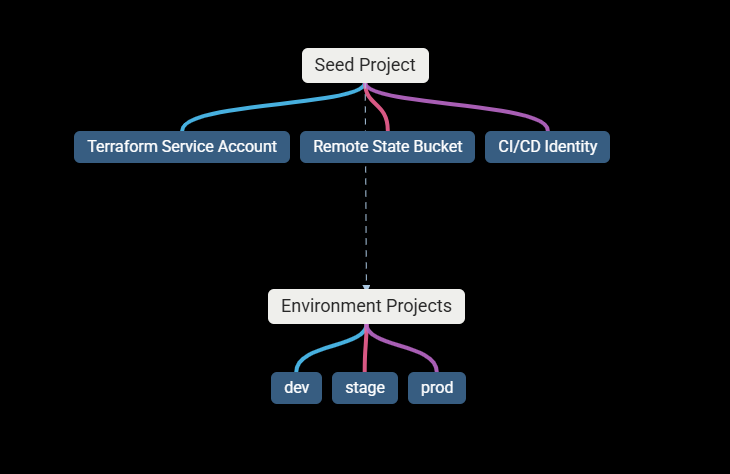

# 🚀 LESSON 3 — HANDS-ON BEGINS

## Enterprise-Style Terraform Setup (Windows 11 + GCP)

From now on:
✔️ We write real code
✔️ We design for production
✔️ We do not rush

## 🔐 Lesson 3 Goal

🚫 No personal credentials
🚫 No random permissions
🚫 No shortcuts

### STEP 1 — Install Required Tools (Correct Way)

#### 1️⃣ Terraform

Download from:
👉 https://developer.hashicorp.com/terraform/downloads

After install:

> terraform -version

#### 2️⃣ Google Cloud SDK

Download:
👉 https://cloud.google.com/sdk/docs/install

Initialize:

> gcloud init

Verify:

> gcloud version

### STEP 2 — Create a Terraform Service Account (Critical)

#### Terraform should run as a non-human identity.

#### 1️⃣ Pick or create a “seed” project (We will NOT manage this project with Terraform.)

e.g : Name of project: platform-seed-project

#### 2️⃣ Create Service Account

> gcloud iam service-accounts create terraform-sa \
>  --display-name "Terraform Platform SA"

#### 3️⃣ Grant minimal required roles (initially)

> gcloud projects add-iam-policy-binding platform-seed-project \
>  --member="serviceAccount:terraform-sa@platform-seed-project.iam.gserviceaccount.com" \
>  --role="roles/editor"

### ⚠️ NOTE:

- We start with editor temporarily.
- Later, we will reduce privileges (real-world practice).

#### 4️⃣ Create Key (Temporary)

> gcloud iam service-accounts keys create terraform-sa-key.json \
>  --iam-account terraform-sa@platform-seed-project.iam.gserviceaccount.com

#### 📌 This key must NEVER be committed to Git.

### STEP 3 — Set Terraform Auth (Local Only)

In powershell:

> $env:GOOGLE_APPLICATION_CREDENTIALS="C:\path\to\terraform-sa-key.json"

Test:

> gcloud auth application-default print-access-token

---

# Q & A

## 1️⃣ Why are we NOT using your personal GCP user?

#### We do not use personal GCP users because:

- Users are ephemeral
- They introduce identity coupling
- They break auditability
- They violate separation of duties
- They cannot be rotated safely

#### Service Accounts are:

- Non-human
- Rotatable
- Least-privileged
- Auditable
- Automatable

### “Infrastructure should be owned by identities that outlive humans.”

---

## 2️⃣ Why is it called a Seed Project? 🌱

🌱 What a Seed Project REALLY Is (Very Important)

### A Seed Project is:

A bootstrap project that exists solely to create and manage everything else.

#### It is called “seed” because:

- It is created manually or once.
- It is not disposable.

#### It contains:

- Terraform Service Accounts
- Remote State buckets
- CI/CD identities
- It seeds all other environments

### ❗ Critical Rule

#### The seed project does NOT host application workloads.

### If this project breaks:

❌ Your platform breaks
❌ Terraform breaks
❌ CI/CD breaks

### That’s why it is:

- Locked down
- Highly restricted
- Rarely changed

### “The seed project is the root of trust for the entire platform.”

---

# 🧠 Mental Model You Must Remember

## Destroying a dev project = OK

## Destroying seed project = career-ending
