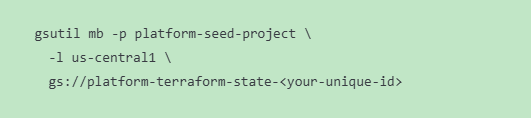
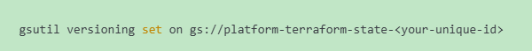
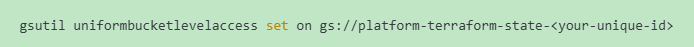
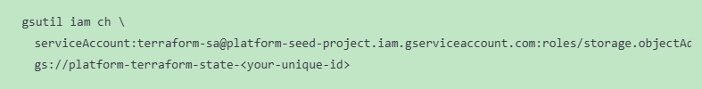
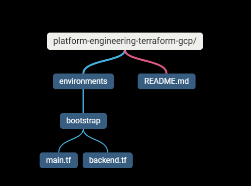
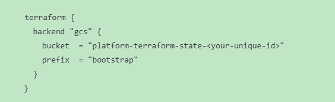
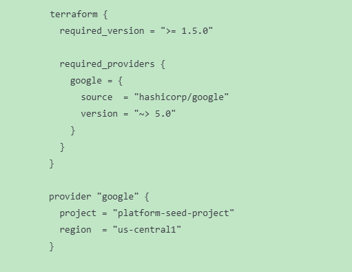

# 🚀 LESSON 4 — Remote State (ENTERPRISE GRADE)

### 🎯 Lesson 4 Goal

Create a secure, versioned, locked Terraform backend using GCS.

### STEP 1 — Create GCS Bucket (Manually, Once)

#### 📌 This bucket is NOT created by Terraform (bootstrap rule).

#### Enable versioning:

#### Enable uniform access:

### STEP 2 — Grant Minimal Access to Terraform SA (storage.objectAdmin)

### STEP 3 — Create Your FIRST Terraform Repo 🚀

#### Repo Name: platform-engineering-terraform-gcp-tf

#### Initial Folder Structure:

### STEP-4 How to configure GCS backend

#### backend.tf

#### main.tf

### STEP-5 Initialize Terraform

> terraform init

#### You should see:

✔️ Backend initialized
✔️ State migrated to GCS

---

# Q & A

## 1️⃣ Why must the backend bucket NOT be managed by Terraform?

#### The backend bucket must not be managed by Terraform because:

- Terraform needs the backend before it can run
- Destroying backend destroys state
- Backend is part of bootstrap trust
- Circular dependency risk

#### “Terraform cannot manage the system that stores its own state.”

---

## 2️⃣ What happens if the backend bucket is deleted?

#### If the backend bucket is deleted:

- Terraform loses source of truth
- Drift becomes undetectable
- Rollbacks become impossible
- Recovery requires manual import
- CI/CD pipelines fail

#### 📌 Important nuance:

#### Infrastructure still exists — but Terraform has amnesia.

---

## 3️⃣ Why is versioning mandatory?

#### Versioning is mandatory because:

- It enables state rollback
- Protects against accidental deletion
- Allows forensic analysis
- Enables recovery from bad applies
- Supports compliance & audits

#### “State versioning is our last line of defense against human error.”

---
