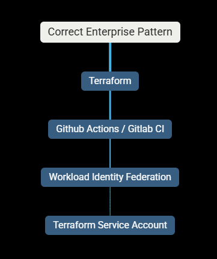
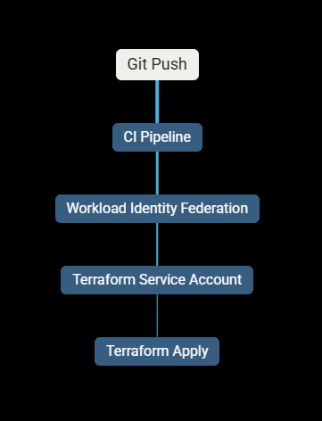

# 🤦‍♂️ LESSON 5 - Terraform Trap 🔥

### Most of the users in production use their user's identity by using ADC (Application Default Credentials) This is one of the big BAD practice.

#### User is authenticate with cloud platform using User's own identity and not by using Service Account.

### Which means:

- 👉 Terraform was not using the Service Account
- 👉 It was using your user identity
- This is a temporary compromise, not a solution.

#### Why?

- You gave your user: roles/storage.objectAdmin

#### Terraform was running using:

- Application Default Credentials (ADC)

---

# ⚠️ Why This Is Dangerous

### Allowed ONLY because:

- Local learning
- No prod resources
- Controlled environment

### NOT allowed in enterprises because:

- Users leave
- Permissions drift
- No identity separation
- No reproducibility

### 📌 Real companies:

Never rely on gcloud auth application-default login for Terraform.

#### Correct Enterprise Flow

- No Keys.
- No User Auth.
- No ADC hacks.

---

# Q & A

### 1️⃣ Why did Terraform access the backend using your USER, not the Service Account?

- Terraform does not magically choose identities.
- Terraform uses Application Default Credentials (ADC) resolution in this order:
  - 1. GOOGLE_APPLICATION_CREDENTIALS (env var)
  - 2. Workload Identity (CI/CD)
  - 3. gcloud ADC (user login)

### In our case, we

- set GOOGLE_APPLICATION_CREDENTIALS earlier
- BUT we later ran:
  > gcloud auth application-default login

#### That command overrode the identity Terraform found first.

#### So Terraform said:

##### “Ah, I have valid ADC from a user — I’ll use that.”

### 📌 Key insight:

#### Terraform does not prefer service accounts. It prefers whatever ADC it finds first.

#### “Terraform accessed the backend using my user because Application Default Credentials resolved to my gcloud user session, not the service account.”

---

### 2️⃣ Why is terraform init -reconfigure sometimes required?

#### terraform init -reconfigure tells Terraform:

#### “Ignore any previously cached backend configuration and reinitialize it.”

#### Terraform caches backend metadata in:

.terraform/ folder.

If:

- Backend auth changes
- Bucket changes
- Prefix changes
- Credentials change

#### Terraform will:

❌ Keep using old cached settings

### -reconfigure forces Terraform to:

- Drop cached backend config
- Re-authenticate
- Reconnect cleanly

## “Reconfigure is needed when backend configuration or credentials change.”

---

### 3️⃣ Where should Terraform actually run in enterprises?

- Terraform should run:
- From CI/CD pipelines
- Using non-human identities
- With environment-scoped permissions
- With manual approvals
- With audit logs

#### More Precisely:

### Note: “Terraform should never run from a developer laptop in production environments.”

---

### 1️⃣ What identity should Terraform use in CI/CD, and why?

Terraform in CI/CD should use a Service Account via Workload Identity Federation because:

- No long-lived keys
- No user coupling
- Identity is ephemeral
- Fully auditable
- Revocable instantly
- Least privilege per environment

#### “Terraform should authenticate using workload identity–backed service accounts, never user credentials or static keys.”

---

### 2️⃣ Why is identity resolution more dangerous than syntax errors?

#### Identity resolution is more dangerous because:

- Wrong identity can silently succeed
- Terraform may apply to wrong environment
- Permissions may be over-scoped
- Mistakes are hard to detect
- Audit trails become misleading

#### 📌 Key insight:

- Syntax errors fail loudly. Identity errors fail quietly.

#### “Identity mistakes don’t crash Terraform — they cause invisible damage.”

---

### 3️⃣ Why is it acceptable to struggle at this stage?

#### It’s acceptable to struggle because:

- Platform engineering involves failure scenarios
- Real systems are non-deterministic
- Understanding comes from debugging, not success
- Seniors are defined by recovery, not perfection

#### “Struggle is where operational intuition is built.”
