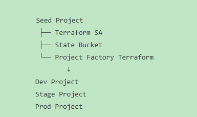
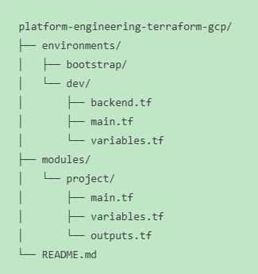
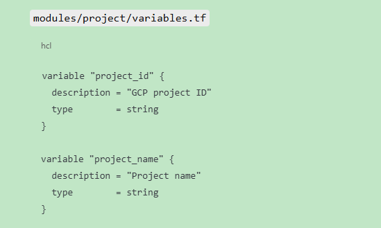
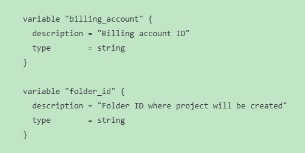
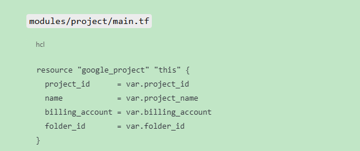
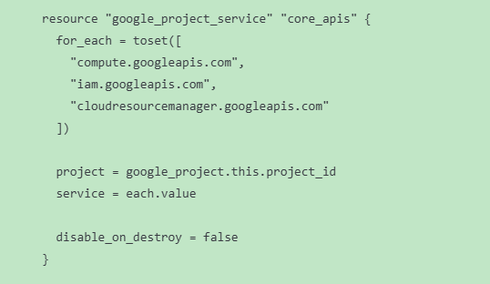
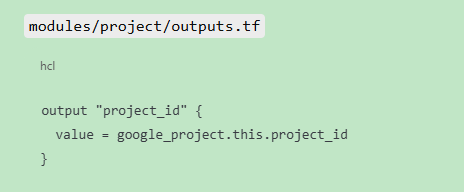
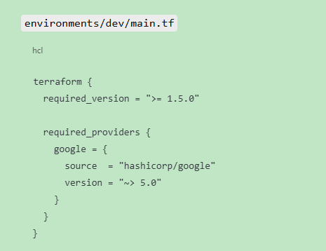
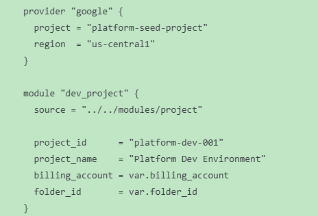
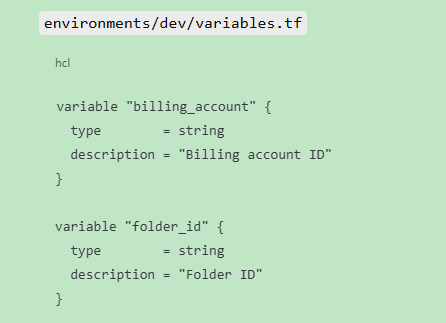

# 🚀 LESSON 6 — PROJECT FACTORY (HANDS-ON, REAL TERRAFORM)

### This is where most tutorials stop.

### This is where real companies begin.

#### 🎯 Lesson Goal

Use Terraform to:

- Create a dev GCP project
- Attach billing
- Assign correct IAM
- Use remote state
- Enforce environment isolation

### 🧠 Mental Model (IMPORTANT)

### For Each (dev/stage/prod) environment:

- Separate project
- Separate state
- Separate permissions

### Step-1 Repo Structure (Extend, Don't break)

### 🔧 STEP 2 — Project Module (Reusable, Opinionated)

#### 1. Variables (Reusable)

#### 2. Main Project

#### 3. Output (shows the output value)

### 🏗 STEP 3 — Dev Environment (Environment Ownership)

### ▶️ STEP 4 — Apply (Controlled)

cd environments/dev

- terraform init
- terraform plan
- terraform apply

---

### Note: We're maintaining the projects important data now with terraform.tfvars file. However, this is temporary purpose and not a good practice. In enterprise level we use credentials specific Google cloud services such as Secret Manager to store the important information / secretive information such as User's email or password as well as Billing Account ID.
