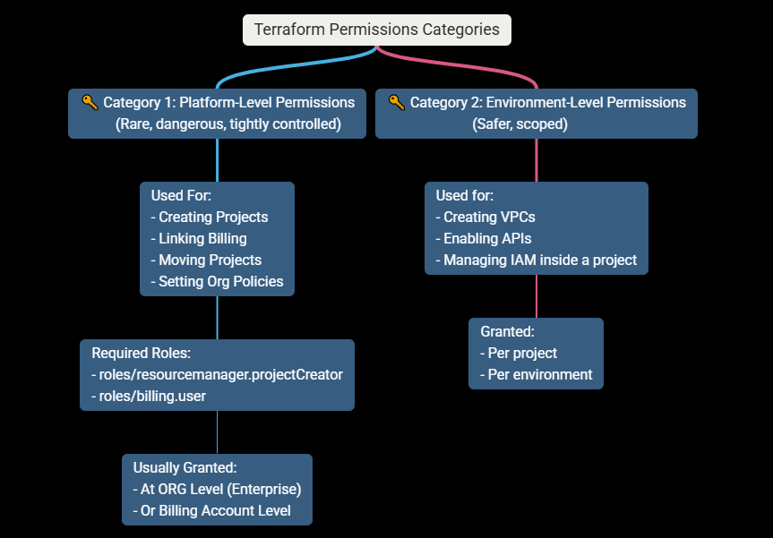
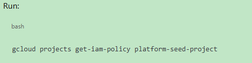
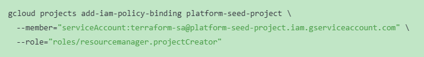
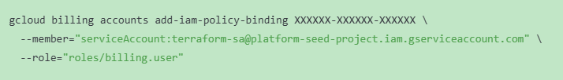
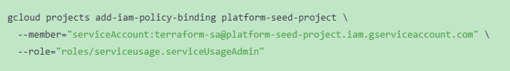
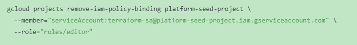

# 🔐 LESSON 7 — IAM HARDENING & REMOVING roles/editor

### 🎯 Goal of This Lesson

By the end of this lesson, you will be able to explain (and implement):

- ❌ Why roles/editor is dangerous
- ✅ What minimum permissions Terraform actually needs
- 🔐 How enterprises design IAM for project creation
- 🧱 How to remove Editor without breaking Terraform

### 🧠 PART 1 — Why roles/editor Is a Red Flag?

#### What roles/editor actually means:

- Create resources
- Modify resources
- Delete resources
- Change IAM
- Enable/disable APIs

#### In other words:

- Editor = near-admin

#### “Editor violates least privilege and hides permission intent.”

#### Why we used it temporarily:

- Bootstrapping
- Learning
- Reducing friction
- ⚠️ But leaving it is unacceptable in real systems.

---

### 🧠 PART 2 — Terraform’s REAL Permission Model (Critical Insight)

#### Terraform does NOT need:

- Broad permissions
- Console access
- Human-like roles

#### Terraform needs:

- Specific APIs
- Specific verbs
- Specific scope

#### We split Terraform permissions into two categories:

---

# 🧱 PART 3 — What We Will Do (Step-by-Step Plan)

#### We will replace Editor with explicit roles, in stages.

#### Stage 1 — Identify what Terraform is actually doing

#### Terraform currently:

- Creates projects
- Links billing
- Enables APIs

#### So we need permissions for:

- Project creation
- Billing attachment
- Service enablement

---

# 🛠️ PART 4 — Remove Editor SAFELY (DO NOT RUSH)

#### 🔍 Step 1 — See current permissions

#### Look for : roles/editor

### 🧹 Step 2 — Replace Editor with explicit roles

- We will remove Editor and add only what is required.

- 1. Grant Project Creator
     

- 2. Grant Billing User (on billing account, NOT project)
     

- 3. Grant Service Usage Admin
     

### 🧹 Step 3 — Remove Editor

---

# 🧪 PART 5 — Validate (VERY IMPORTANT)

#### Now re-run Terraform from:

##### environments/dev

##### > terraform plan

##### > terraform apply

### Expected result:

- ✔️ Still works
- ✔️ No permission errors
- ✔️ Editor gone

#### Note: “We start with broad permissions only during bootstrap, then progressively restrict Terraform to least privilege once the platform stabilizes.”

---

# Q & A

### Why is project creation a platform-level permission?

- Project creation is a platform-level permission because it defines the foundational boundary for isolation, governance, billing, IAM, and policy enforcement.
- Creating a project is not an application concern; it is an organizational decision that impacts cost, security, compliance, and lifecycle management.

#### “Project creation defines organizational boundaries, not workloads.”

### Why is billing access not granted at the project level?

- Billing accounts are not tied to individual projects because billing represents an organizational financial boundary.
- Centralized billing enables cost allocation, governance, auditing, and financial control across multiple projects while preventing individual teams from bypassing financial guardrails.

#### “Billing is an organizational concern, not a project concern.”

### What would break if a workload team had projectCreator?

- Granting projectCreator to workload teams breaks governance by allowing uncontrolled environment creation, bypassing architectural standards, cost controls, security baselines, and auditability.
- It shifts platform responsibility to application teams, which leads to sprawl and compliance risk.

#### “Uncontrolled project creation equals uncontrolled risk.”

---
