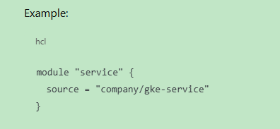

# 🚀 LESSON 8 — ENVIRONMENT OWNERSHIP MODEL

#### You will understand:

- Who owns dev
- Who owns prod
- Why prod access should feel dangerous
- How Terraform enforces boundaries

### 🧠 PART 1 — ENVIRONMENTS ARE TRUST ZONES

#### Dev:

- Experimental
- Fast feedback
- Broad access (but not admin)

#### Prod:

- Revenue-impacting
- Locked down
- Audited
- Fear is healthy 😄

#### “Environments represent trust boundaries, not just stages.”

### 🧱 PART 2 — REAL ENTERPRISE OWNERSHIP MODEL

#### Workload teams:

- ❌ Cannot create projects
- ❌ Cannot change IAM in prod
- ❌ Cannot bypass pipelines

### 🔐 PART 3 — IAM MODEL (PRACTICAL)

#### We now stop using humans for infra changes.

#### Principle:

- Humans commit code.
- Pipelines apply infrastructure.

### 🛠️ WHAT YOU WILL IMPLEMENT NEXT

#### Step 1 — Create environment-level Terraform SA

#### Step 2 — Grant minimal roles

#### 🧠 WHY THIS MATTERS?

#### You’re now designing:

- Ownership boundaries
- Blast-radius control
- Promotion safety
- Audit trails
- This is exactly what Platform Engineers do.

---

# Q & A

### Why should prod access feel uncomfortable?

- Highest responsibility
- Real users
- Blast radius
- External threats

#### Production access should feel uncomfortable because it represents the highest blast radius. Any mistake directly impacts customers, revenue, and trust. Discomfort creates discipline, caution, and respect for process — which are essential for operating critical systems.

#### “Comfort in production is a warning sign.”

---

### Why should humans not apply Terraform in prod?

- Zero-trust
- Human error
- Repeatability
- Rollback and recovery

#### Humans should not apply Terraform in production because infrastructure changes must be deterministic, auditable, repeatable, and reversible. CI/CD pipelines enforce consistency, peer review, and traceability, while minimizing the risk of human error.

#### “Humans review changes; systems apply them.”

---

### What happens if the dev service account has prod permissions?

- Chaos
- Security risk
- Loss of separation
- No value in environments

#### If a dev service account has prod permissions, environment boundaries collapse. This enables accidental or malicious changes, breaks auditability, and invalidates the purpose of having separate environments.

#### “Shared identity equals shared blast radius.”

---

### VIMP Concept with following question.

#### Question: If developers can’t run Terraform locally, how do they still move fast?

- Developers move fast without running Terraform locally because they get rapid feedback through CI pipelines, reusable modules, isolated environments, and safe defaults. Terraform is executed centrally, but iteration speed is preserved through automation, previews, and self-service abstractions.

#### 🧠 The Real Mechanisms That Preserve Speed

#### 1️⃣ Developers Still Write Terraform Code

##### ❗ Important correction:

- Developers DO write Terraform, they just don’t apply it locally.

##### They:

- Edit modules
- Change variables
- Add resources
- Submit merge requests

#### 2️⃣ Speed Comes From Fast Feedback, Not Local Apply

##### Instead of:

- terraform apply

#### They get:

- terraform validate
- terraform fmt
- terraform plan

#### 👉 Automatically, in CI, in minutes.

#### 📌 Key idea:

##### “Speed comes from fast feedback, not from bypassing controls.”

#### 3️⃣ Safe Defaults & Reusable Modules

#### Developers don’t build infra from scratch.

##### They consume:

- Approved modules
- Guardrailed inputs
- Opinionated defaults

#### 👉 This avoids long design cycles.

#### 4️⃣ Environment Isolation Preserves Velocity

- Dev environments are fast
- Sandboxes exist
- Blast radius is low

#### Developers can:

- Break dev
- Reapply
- Iterate
- Without touching prod.

#### 5️⃣ Humans Review, Systems Execute

##### This is the key sentence you should internalize:

##### Developers propose changes; pipelines apply them.

##### This allows:

- Speed
- Safety
- Auditability
- At the same time.

#### "Developers move fast by iterating through CI-driven feedback loops, reusable Terraform modules, and isolated environments. Terraform execution is centralized, but speed is preserved through automation and self-service abstractions rather than local apply."

---
