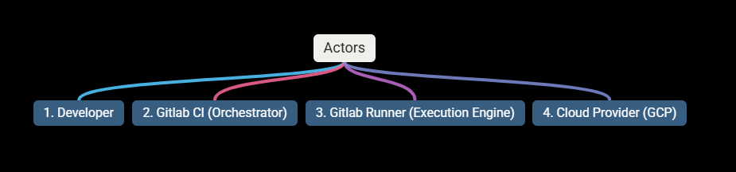
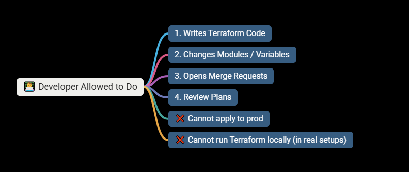
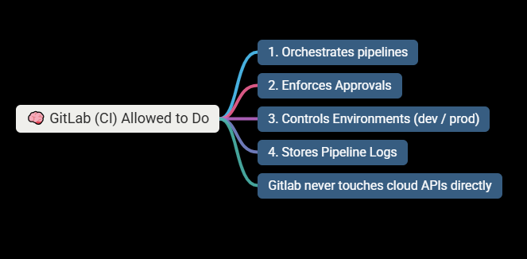
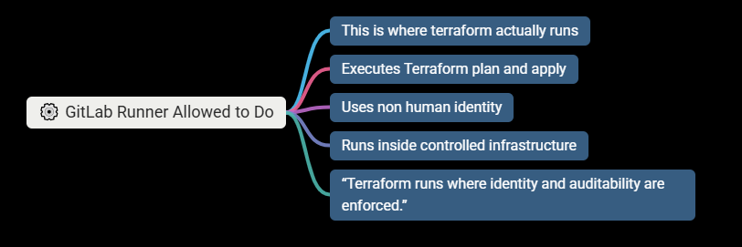
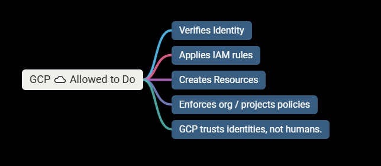
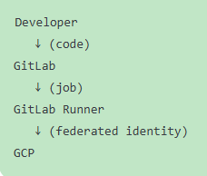

# Lesson 9 — Terraform + GitLab CI (Architecture)

### ⚠️ Important rule for today

- No YAML yet.
- No commands yet.
- Only architecture, trust flow, and mental models.

### 🧠 LESSON 9 — HOW TERRAFORM REALLY RUNS IN ENTERPRISES

#### 🔥 The Core Shift

- Terraform does not “belong” to developers’ laptops.
- Terraform belongs to the platform execution environment.

---

### 🧩 1️⃣ Who Are the Actors?

#### There are four actors — memorize this:

#### Note: No one else should touch Terraform.

---

### 🧱 2️⃣ What Each Actor Is Allowed to Do

#### Developer

#### Gitlab CI

#### Gitlab Runner

#### GCP

---

### 3️⃣ Identity Flow

#### Trust Chain is as follows:

- #### ❗ No keys
- #### ❗ No service account JSON
- #### ❗ No gcloud auth login

#### This is Workload Identity Federation

---

### 🧠 4️⃣ Why This Model Is Fast AND Safe

#### Speed comes from:

- Fast CI feedback (plan in minutes)
- Reusable modules
- Dev environment freedom

#### Safety comes from:

- Central execution
- IAM boundaries
- Protected prod pipelines
- Human approval gates

#### “Velocity is achieved through automation, not through bypassing controls.”

---

### 🚨 5️⃣ Why Local Terraform Is Dangerous.

#### Local Terraform breaks:

- Identity guarantees
- Audit trails
- Reproducibility
- Policy enforcement
- Blast-radius control

#### "Even senior engineers should not apply locally in prod systems."

---

### 🧭 Where Networking Fits (Nice Tie-in)

#### Terraform + CI/CD interacts with:

- Private runners
- VPC access
- NAT / egress
- API endpoints
- Firewall rules

---

# Questions and Answers

### 1. Where does Terraform actually run in enterprise setups?

- Terraform runs inside a controlled platform execution environment, typically a CI runner, where identity, permissions, auditability, and policy enforcement are centrally managed.

#### “Terraform runs in the platform, not on developer laptops.”

---

### Why is the GitLab Runner more important than GitLab itself?

- The GitLab Runner is critical because it is the execution boundary where Terraform runs, identities are assumed, permissions are enforced, and actions become auditable. GitLab orchestrates, but the runner executes.

- #### GitLab decides when to run;
- #### the runner decides what actually happens.

---

### Why is identity the center of everything here?

- Identity is central because it determines what actions are allowed, how they are audited, where blast radius is contained, and whether infrastructure changes are reproducible and policy-compliant.

#### “In cloud platforms, identity is the control plane.”

---

### Why should terraform apply never run automatically for prod?

- Terraform apply should never run automatically in production because production changes must be explicitly reviewed and approved to prevent unintended outages, control blast radius, and maintain accountability.

- OR

- Automation should enforce safety, not remove human judgment for production changes.

---

# 🧠 Why This Matters (Deep Insight)

#### Auto-apply in prod removes:

- Intent
- Context
- Responsibility

#### Manual approval ensures:

- Someone understands the change
- Someone owns the risk
- There is a human checkpoint before blast radius

#### 📌 This is not about distrust — it’s about shared responsibility.

---
